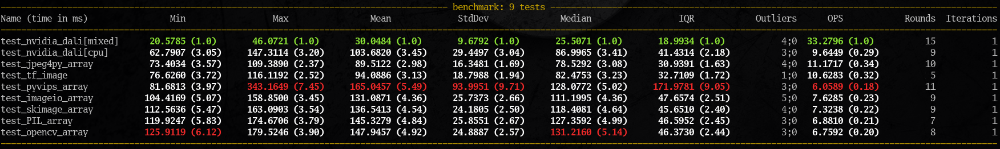

Python image decoding benchmark
===============================



Use docker to run the pre-built image on your images set:

```bash
docker run -it --rm -v /path/to/images/:/images -e IMAGES_PATTERN="/images/*" eigrad/imbench
```

You can optinally rebuild the image from this the repository:

```bash
git clone https://github.com/ei-grad/imbench.git
cd imbench
docker build -t eigrad/imbench .
```

Or install requirements and check the performance in your environment:

```bash
git clone https://github.com/ei-grad/imbench.git
cd imbench
pip install -r requirements.txt
pytest imbench.py
```

Optional pyvips
---------------

```
apt install libvips-dev
pip install pyvips
```
